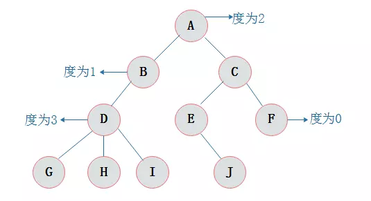
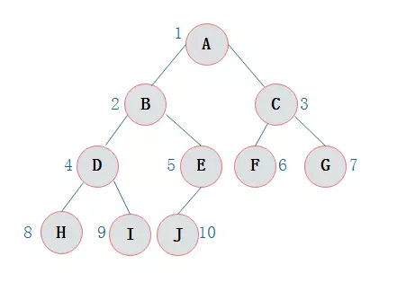

一.树

1 .1 **树（Tree**是n（n>=0)个结点的有限集。n=0时称为空树。在任意一颗非空树中：
1）有且仅有一个特定的称为根（Root）的结点；
2）当n>1时，其余结点可分为m(m>0)个互不相交的有限集T1、T2、......、Tn，其中每一个集合本身又是一棵树，
并且称为根的子树。

此外，树的定义还需要强调以下两点：
1）n>0时根结点是唯一的，不可能存在多个根结点，数据结构中的树只能有一个根结点。
2）m>0时，子树的个数没有限制，但它们一定是互不相交的。

1 .2 节点的度

结点拥有的子树数目称为结点的度。

1 .3 结点的层次
从根开始定义起，根为第一层，根的孩子为第二层，以此类推。

1 .4 树的深度

树中结点的最大层次数称为树的深度或高度。

二.二叉树

2 .1定义

二叉树是n(n>=0)个结点的有限集合，该集合或者为空集（称为空二叉树），或者由一个根结点和两棵互不相交的、分别称为根结点的左子树和右子树组成。

2 .2 二叉树的特点

由二叉树定义得出二叉树有以下特点：
1）每个结点最多有两颗子树，所以二叉树中不存在度大于2的结点。
2）左子树和右子树是有顺序的，次序不能任意颠倒。
3）即使树中某结点只有一棵子树，也要区分它是左子树还是右子树。

2 .3 二叉树性质
1）在二叉树的第i层上最多有2^i-1 个节点 。（i>=1）
2）二叉树中如果深度为k,那么最多有2k-1个节点。(k>=1）
3）n0=n2+1 n0表示度数为0的节点数，n2表示度数为2的节点数。
4）在完全二叉树中，具有n个节点的完全二叉树的深度为[log2n]+1，其中[log2n]是向下取整。
5）若对含 n 个结点的完全二叉树从上到下且从左至右进行 1 至 n 的编号，
则对完全二叉树中任意一
个编号为 i 的结点有如下特性：

- 若 i=1，则该结点是二叉树的根，无双亲, 否则，编号为 [i/2] 的结点为其双亲结点;
- 若 2i>n，则该结点无左孩子， 否则，编号为 2i 的结点为其左孩子结点；
- 若 2i+1>n，则该结点无右孩子结点， 否则，编号为2i+1 的结点为其右孩子结点。

三 . 斜树

二叉树只有左子树或只有右子树,斜树也相当于线性链表

四 . 完全二叉树

对一颗具有n个结点的二叉树按层编号，如果编号为i(1<=i<=n)的结点与同样深度的满二叉树中编号为i的结点在二叉树中位置完全相同，则这棵二叉树称为完全二叉树。

特点：
1）叶子结点只能出现在最下层和次下层。
2）最下层的叶子结点集中在树的左部。
3）倒数第二层若存在叶子结点，一定在右部连续位置。
4）如果结点度为1，则该结点只有左孩子，即没有右子树。
5）同样结点数目的二叉树，完全二叉树深度最小。
注：满二叉树一定是完全二叉树，但反过来不一定成立。

五 . 二叉树的遍历

根据二叉树遍历的节点访问次序可以分为以下遍历类型:

- 前序遍历
- 中序遍历
- 后序遍历
- 层序遍历

5 .1前序遍历
通俗的说就是从二叉树的根结点出发，当第一次到达结点时就输出结点数据，按照先向左在向右的方向访问。

从根结点出发，则第一次到达结点A，故输出A;

继续向左访问，第一次访问结点B，故输出B；

按照同样规则，输出D，输出H；

当到达叶子结点H，返回到D，此时已经是第二次到达D，故不在输出D，进而向D右子树访问，D右子树不为空，则访问至I，第一次到达I，则输出I；

I为叶子结点，则返回到D，D左右子树已经访问完毕，则返回到B，进而到B右子树，第一次到达E，故输出E；

向E左子树，故输出J；

按照同样的访问规则，继续输出C、F、G；

二叉树的前序遍历输出为：ABDHIEJCFG

5 .2中序遍历

中序遍历就是从二叉树的根结点出发，当第二次到达结点时就输出结点数据，按照先向左在向右的方向访问。

从根结点出发，则第一次到达结点A，不输出A，继续向左访问，第一次访问结点B，不输出B；继续到达D，H；
到达H，H左子树为空，则返回到H，此时第二次访问H，故输出H；
H右子树为空，则返回至D，此时第二次到达D，故输出D；
由D返回至B，第二次到达B，故输出B；
按照同样规则继续访问，输出J、E、A、F、C、G；

二叉树的中序遍历输出为：
HDIBJEAFCG

5 .3 后序遍历

后序遍历就是从二叉树的根结点出发，当第三次到达结点时就输出结点数据，按照先向左在向右的方向访问。

二叉树后序访问如下：

从根结点出发，则第一次到达结点A，不输出A，继续向左访问，第一次访问结点B，不输出B；继续到达D，H；

到达H，H左子树为空，则返回到H，此时第二次访问H，不输出H；

H右子树为空，则返回至H，此时第三次到达H，故输出H；

由H返回至D，第二次到达D，不输出D；

继续访问至I，I左右子树均为空，故第三次访问I时，输出I；

返回至D，此时第三次到达D，故输出D；

按照同样规则继续访问，输出J、E、B、F、G、C，A；

二叉树的后序遍历输出为：
HIDJEBFGCA

5 .4 层次遍历

层次遍历就是按照树的层次自上而下的遍历二叉树。针对图所示二叉树的层次遍历结果为：
ABCDEFGHIJ

