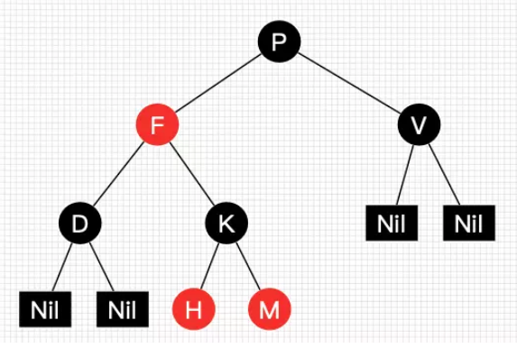
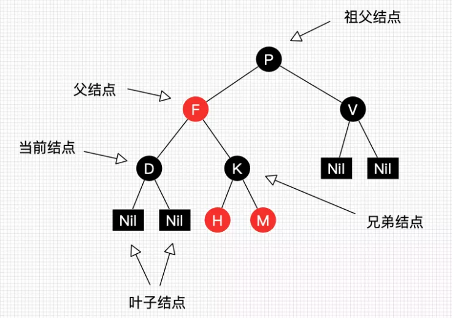
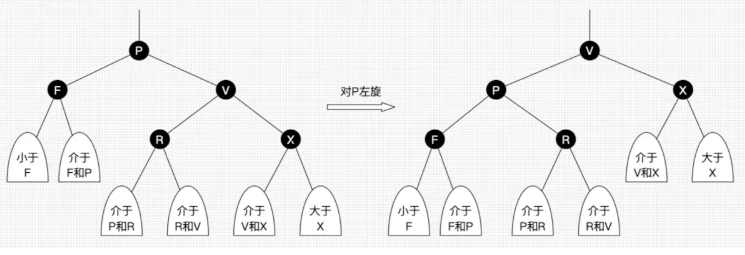
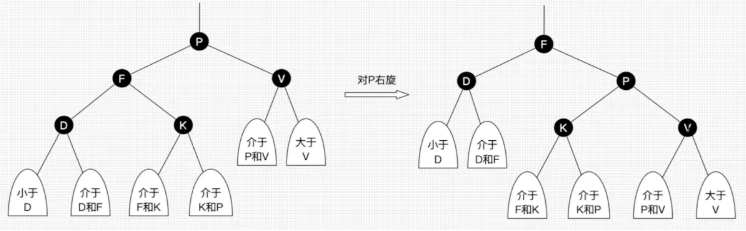
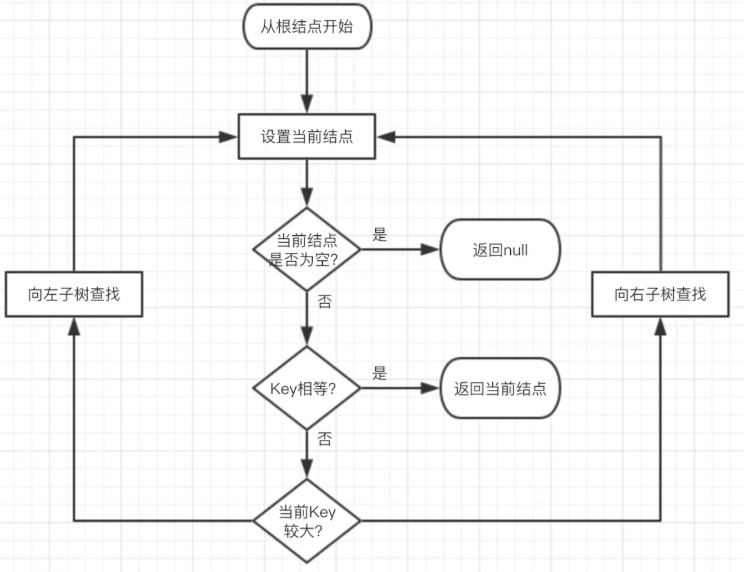
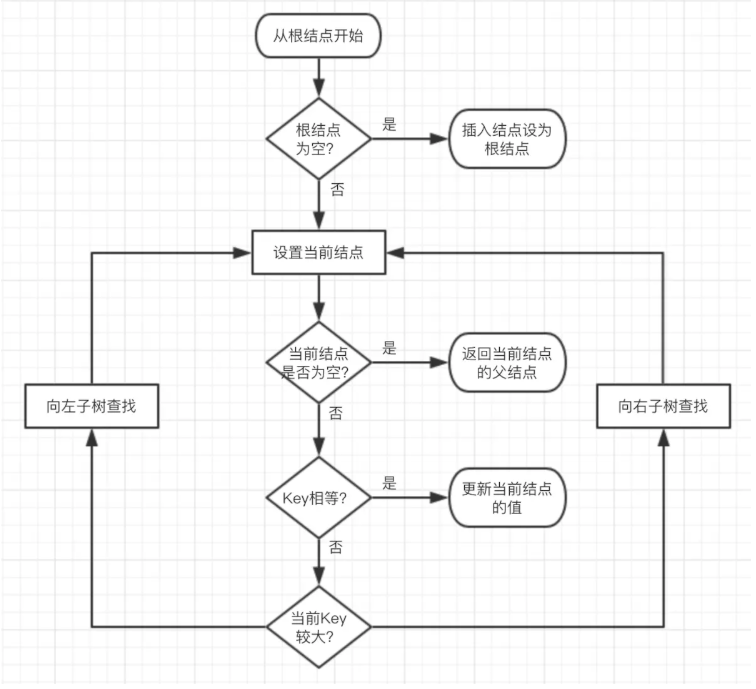

一 . 定义

二叉树的一种变种,为保证左右子树相对平衡不会出现极端情况(退化成斜树)而采取节点上色的方案,将节点标记为红色或者黑色，在计算树的深度时只统计黑色节点的数量，不统计红色节点数量。

而保持左右子树深度相同的原因是减少树的最大深度，从而提高查询的效率，尽量维持左右子树的深度一致，避免某个子树深度过深的情况出现，如果某个子树深度过深，查找算法的时间复杂度就下降为链表的时间复杂度O(n)，为了保证左右子树的平衡，红黑树定义了一些规则或者特点来维持平衡。

二.红黑树的主要特征

- 每个节点要么是黑色，要么是红色。（节点非黑即红）
- 根节点为黑色
- 每个叶子节点（NIL）是黑色（值得提醒注意的是，在Java中，叶子结点是为null的结点。）。
- 如果一个节点是红色的，则它的子节点必须是黑色的。（也就是说父子节点不能同时为红色）
- 从一个节点到该节点的每一个叶子子孙节点的所有路径上包含相同数目的黑节点。（这一点是平衡的关键）
- 新插入节点默认为红色，插入后需要校验红黑树是否符合规则，不符合则需要进行操作。

红黑树并不是一个完美平衡二叉查找树，从上图可以看到，根结点P的左子树显然比右子树高，
但左子树和右子树的黑结点的层数是相等的，
也即任意一个结点到到每个叶子结点的路径都包含数量相同的黑结点。
所以我们叫红黑树这种平衡为黑色完美平衡。

我们把正在处理(遍历)的结点叫做当前结点，如下图中的D，它的父亲叫做父结点，它的父亲的另外一个子结点叫做兄弟结点，父亲的父亲叫做祖父结点。

HashMap在进行插入和删除时有可能会触发红黑树的插入平衡调整（balanceInsertion方法）
或删除平衡调整（balanceDeletion ）方法，
调整的方式主要有以下手段：
左旋转（rotateLeft方法）、右旋转（rotateRight方法）、颜色反转（x.red = false、x.red = true），
进行调整的原因是为了维持红黑树的数据结构。

- **左旋**：以某个结点作为支点(旋转结点)，其右子结点变为旋转结点的父结点，右子结点的左子结点变为旋转结点的右子结点，左子结点保持不变。如图3。
- **右旋**：以某个结点作为支点(旋转结点)，其左子结点变为旋转结点的父结点，左子结点的右子结点变为旋转结点的左子结点，右子结点保持不变。如图4。
- **变色**：结点的颜色由红变黑或由黑变红。

我们先忽略颜色，可以看到旋转操作不会影响旋转结点的父结点，父结点以上的结构还是保持不变的。
左旋只影响旋转结点和其右子树的结构，把右子树的结点往左子树挪了。

右旋只影响旋转结点和其左子树的结构，把左子树的结点往右子树挪了。

所以旋转操作是局部的。另外可以看出旋转能保持红黑树平衡的一些端详了：当一边子树的结点少了，那么向另外一边子树“借”一些结点；当一边子树的结点多了，那么向另外一边子树“租”一些结点。

红黑树的遍历

因为红黑树是一颗二叉平衡树，并且查找不会破坏树的平衡，所以查找跟二叉平衡树的查找无异：

- 从根结点开始查找，把根结点设置为当前结点；
- 若当前结点为空，返回null；
- 若当前结点不为空，用当前结点的key跟查找key作比较；
- 若当前结点key等于查找key，那么该key就是查找目标，返回当前结点；
- 若当前结点key大于查找key，把当前结点的左子结点设置为当前结点，重复步骤2；
- 若当前结点key小于查找key，把当前结点的右子结点设置为当前结点，重复步骤2；

正由于红黑树总保持黑色完美平衡，所以它的查找最坏时间复杂度为O(2lgN)，也即整颗树刚好红黑相隔的时候。

红黑树插入

插入操作包括两部分工作：一查找插入的位置；二插入后自平衡。查找插入的父结点很简单，跟查找操作区别不大：

- 从根结点开始查找；
- 若根结点为空，那么插入结点作为根结点，结束。
- 若根结点不为空，那么把根结点作为当前结点；
- 若当前结点为null，返回当前结点的父结点，结束。
- 若当前结点key等于查找key，那么该key所在结点就是插入结点，更新结点的值，结束。
- 若当前结点key大于查找key，把当前结点的左子结点设置为当前结点，重复步骤4；
- 若当前结点key小于查找key，把当前结点的右子结点设置为当前结点，重复步骤4；

