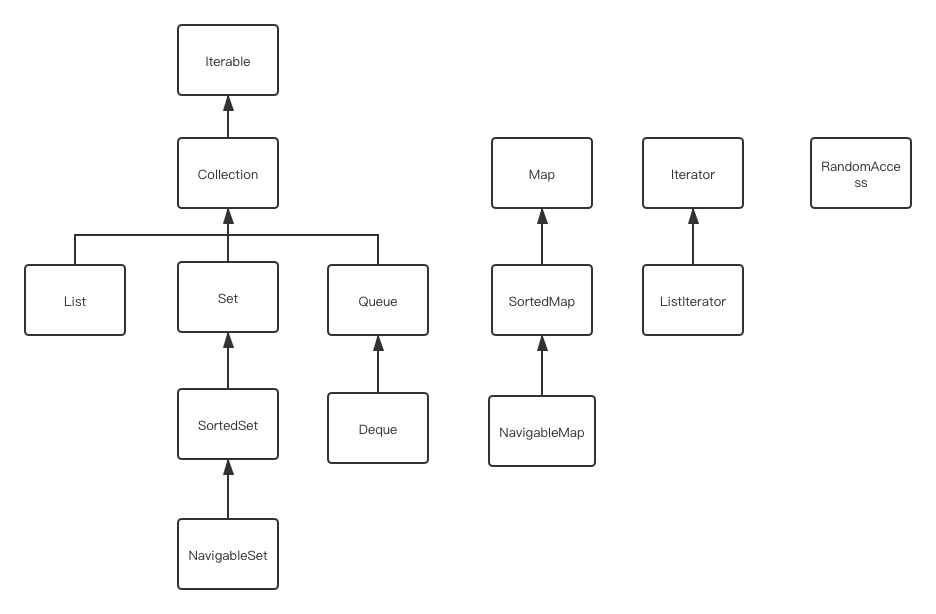

# Java集合

### 一、Collection 接口

集合类的基本接口是 Collection 接口。这个接口定义了两个基本的方法：

```Java
public interface Collection<E>{
		boolean add(E element);
		Iterator<E> iterator();
}
```


1.迭代器

Iterator接口包含 4 个方法：

```Java
public interface Iterator<E>{
		E next();
		boolean hasNext();
		void remove();
		default void forEachRemaining(Consumer<? super E> action);
}
```

在使用迭代器的过程中需要使用 hasNext()方法判断是否存在下一个元素，否则直接使用 next()方法 很可能出现 NoSuchElementException。因此，需要在调用 next 之前调用 hasNext方法。

注：for-each循环操作时，编译器会将该循环方式转换为带有迭代器的循环，任何实现 Iterator接口的对象都可以用 for each 方法进行迭代。

对应 Collection，任何 Collection的实现类都可以使用 for each。循环访问的元素顺序是由具体的实现类的元素的有序性进行的。迭代器遍历集合的时候是在两个元素直接移动的。


2.Collection 常用 API

```Java
Iterator<E> iterator();  返回一个用于访问集合中各个元素的迭代器

int size();
  
boolean isEmpty();

boolean contains(Object obj);

boolean containsAll(Collection<?> other)
  
boolean add(E element);

boolean addAll(Collention<? extends E> other);

boolean remove(Object obj);

boolean removeAll(Collectin<?> other);

default boolean removeIf(Predicate<? super E>filter);//从这个集合中删除所有与 other 集合中元素不同的元素。如果由于这个调用改变了集合，返回 true

void clear();

boolean retainAll(Collection<?> other);//从当前集合删除所有 other 集合中相不同的元素。如果改变了集合则返回 true;
Object[] toArray();//返回这个集合中的对象的数组
```


### 二、集合框架


在 Java中集合有两个基本的接口：Collection 和 Map。常用的集合都是根据这两个基本的接口实现的。

注：RandomAccess 接口是标记接口，接口内部没有定义方法，只用来标记其他集合是否支持随机访问，即通过元素的索引进行访问，而且该接口与集合随机访问的特性没有因果关系。

1.具体的集合

| 集合类型        | 描述                                         |
| --------------- | -------------------------------------------- |
| LinkedList      | 可以动态增长和缩减的一个索引序列             |
| LinkedList      | 可以在任何位置高效插入和删除的一个有序序列   |
| ArrayDeque      | 实现为循环数组的一个双端队列                 |
| HashSet         | 没有重复元素的一个有序集合                   |
| TreeSet         | 一个有序集                                   |
| EnumSet         | 一个包含枚举类型之的集                       |
| LinkedHashSet   | 一个可以记住元素插入次序的集                 |
| PriorityQueue   | 允许高效删除最小元素的一个集合               |
| HashMap         | 存储键值对的数据结构                         |
| TreeMap         | 键有序的一个映射                             |
| EnumMap         | 键属于枚举类型的一个映射                     |
| LinkedHashMap   | 可以记住键值对添加次序的映射                 |
| WeakHashMap     | 键不会再别处使用时就可以被 GC 回收的一个映射 |
| IdentityHashMap | 用==而不是 equals比较键的一个映射            |

