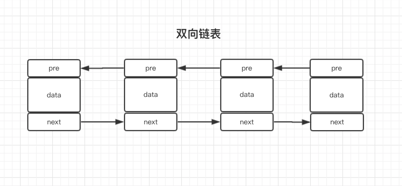
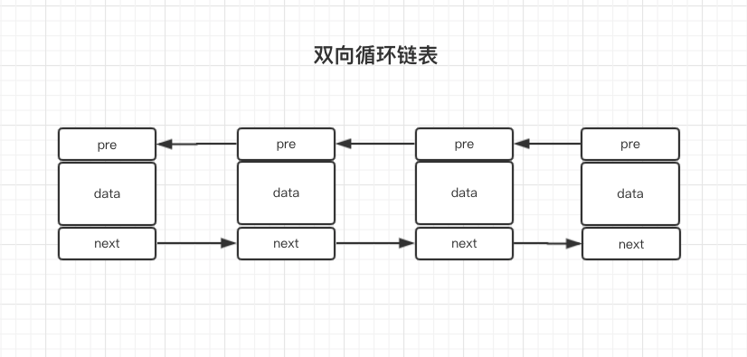
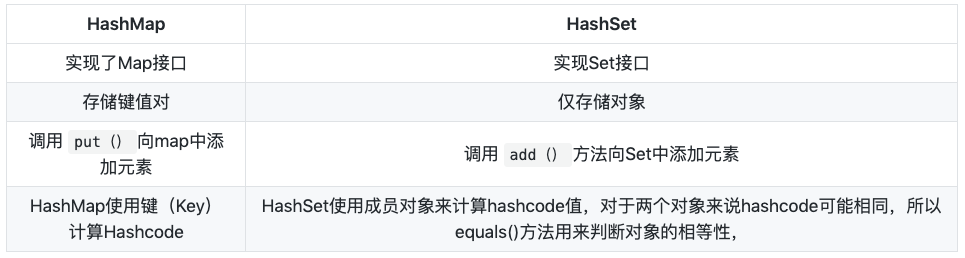

一,List/Set/Map特性
- List:List接口存储一组不唯一（可以有多个元素引用相同的对象），有序的对象
- Set:元素无序唯一
- Map:Map会维护与Key有关联的值。两个Key可以引用相同的对象，但Key不能重复，典型的Key是String类型，但也可以是任何对象。

二,ArrayList与LinkList

1 . 线程安全性:二者都不是同步的,也计算说不是线程安全

2 . 底层数据结构： Arraylist 底层使用的是 Object 数组；
LinkedList 底层使用的是 双向链表 数据结构（JDK1.6之前为循环链表，JDK1.7取消了循环。

3 .  插入和删除是否受元素位置的影响: 

① ArrayList 采用数组存储，所以插入和删除元素的时间复杂度受元素位置的影响。 比如：执行add(E e) 方法的时候， ArrayList 会默认在将指定的元素追加到此列表的末尾，这种情况时间复杂度就是O(1)。
但是如果要在指定位置 i 插入和删除元素的话（add(int index, E element) ）时间复杂度就为 O(n-i)。
因为在进行上述操作的时候集合中第 i 和第 i 个元素之后的(n-i)个元素都要执行向后位/向前移一位的操作。 

② LinkedList 采用链表存储，所以插入，删除元素时间复杂度不受元素位置的影响，都是近似 O（1）而数组为近似 O（n）。

4 . 是否支持快速随机访问： LinkedList 不支持高效的随机元素访问，而 ArrayList 支持。数组天然支持随机访问
快速随机访问就是通过元素的序号快速获取元素对象(对应于get(int index) 方法)。链表需要遍历到特定位置才能访问特定位置的元素.
RandomAccess 接口只是标识，并不是说 ArrayList 实现 RandomAccess 接口才具有快速随机访问功能的！

5 . 内存空间占用： ArrayList的空间浪费主要体现在在list列表的结尾会预留一定的容量空间，
而LinkedList的空间花费则体现在它的每一个元素都需要消耗比ArrayList更多的空间
（因为要存放直接后继和直接前驱以及数据）。

双向链表与双向循环链表

双向链表： 包含两个指针，一个prev指向前一个节点，一个next指向后一个节点。

双向循环链表： 最后一个节点的 next 指向head，而 head 的prev指向最后一个节点，构成一个环。

ArrayList 与 Vector 区别呢?为什么要用Arraylist取代Vector呢？

Vector类的所有方法都是同步的。可以由两个线程安全地访问一个Vector对象、但是一个线程访问Vector的话代码要在同步操作上耗费大量的时间。

Arraylist不是同步的，所以在不需要保证线程安全时建议使用Arraylist。

HashMap 和 Hashtable 的区别

- 线程是否安全： HashMap 是非线程安全的，HashTable 是线程安全的；HashTable 内部的方法基本都经过synchronized 修饰。（如果你要保证线程安全的话就使用 ConcurrentHashMap 吧！）；
- 效率： 因为线程安全的问题，HashMap 要比 HashTable 效率高一点。另外，HashTable 基本被淘汰，不要在代码中使用它；
- 对Null key 和Null value的支持： HashMap 中，null 可以作为键，这样的键只有一个，可以有一个或多个键所对应的值为 null。。
但是在 HashTable 中 put 进的键值只要有一个 null，直接抛出 NullPointerException。
- 初始容量大小和每次扩充容量大小的不同 ： 
①创建时如果不指定容量初始值，Hashtable 默认的初始大小为11，之后每次扩充，容量变为原来的2n+1。
HashMap 默认的初始化大小为16。之后每次扩充，容量变为原来的2倍。
②创建时如果给定了容量初始值，那么 Hashtable 会直接使用你给定的大小，
而 HashMap 会将其扩充为2的幂次方大小（HashMap 中的tableSizeFor()方法保证）。
也就是说 HashMap 总是使用2的幂作为哈希表的大小,后面会介绍到为什么是2的幂次方。
- 底层数据结构： JDK1.8 以后的 HashMap 在解决哈希冲突时有了较大的变化，当链表长度大于阈值（默认为8）时，
将链表转化为红黑树，以减少搜索时间。Hashtable 没有这样的机制。

HashMap 和 HashSet区别

HashSet 底层就是基于 HashMap 实现的。HashSet 的源码非常非常少，因为除了 clone() 、writeObject()、readObject()是 HashSet 自己不得不实现之外，其他方法都是直接调用 HashMap 中的方法。

HashSet如何检查重复

HashSet会先计算对象的hashcode值来判断对象加入的位置，同时也会与其他加入的对象的hashcode值作比较，如果没有相符的hashcode，HashSet会假设对象没有重复出现。但是如果发现有相同hashcode值的对象，这时会调用equals（）方法来检查hashcode相等的对象是否真的相同。如果两者相同，HashSet就不会让加入操作成功。

关于hashCode（）与equals（）的相关规定：

- 如果两个对象相等，则hashcode一定也是相同的
- 两个对象相等,对两个equals方法返回true
- 两个对象有相同的hashcode值，它们也不一定是相等的
- 综上，equals方法被覆盖过，则hashCode方法也必须被覆盖
- hashCode()的默认行为是对堆上的对象产生独特值。如果没有重写hashCode()，则该class的两个对象无论如何都不会相等（即使这两个对象指向相同的数据）。

关于==与equals的区别

- ==是判断两个变量或实例**是不是指向同一个内存空间** 
equals是判断两个变量或实例所指向的**内存空间的值是不是相同**
- ==是指对内存地址进行比较 
equals()是对字符串的内容进行比较
- ==指引用是否相同 equals()指的是值是否相同

ConcurrentHashMap 和 Hashtable 的区别

ConcurrentHashMap 和 Hashtable 的区别主要体现在实现线程安全的方式上不同。

- 底层数据结构： JDK1.7的 ConcurrentHashMap 底层采用 分段的数组+链表 实现，
JDK1.8 采用的数据结构跟HashMap1.8的结构一样，数组+链表/红黑二叉树。
Hashtable 和 JDK1.8 之前的 HashMap 的底层数据结构类似都是采用 数组+链表 的形式，
**数组是 HashMap 的主体**，链表则是主要为了解决哈希冲突而存在的；

- 实现线程安全的方式（重要）： 
① 在JDK1.7的时候，ConcurrentHashMap（分段锁） 对整个桶数组进行了分割分段(Segment,Segment继承了ReentrantLock，所以它就是一种可重入锁（ReentrantLock))，
每一把锁只锁容器其中一部分数据，多线程访问容器里不同数据段的数据，就不会存在锁竞争，提高并发访问率。 
到了 JDK1.8 的时候已经摒弃了Segment的概念，而是直接用 Node 数组+链表+红黑树的数据结构来实现，并发控制使用 synchronized 和 CAS 来操作。
（JDK1.6以后 对 synchronized锁做了很多优化） 整个看起来就像是优化过且线程安全的 HashMap，虽然在JDK1.8中还能看到 Segment 的数据结构，但是已经简化了属性，只是为了兼容旧版本；

② Hashtable(同一把锁) :使用 synchronized 来保证线程安全，效率非常低下。
当一个线程访问同步方法时，其他线程也访问同步方法，可能会进入阻塞或轮询状态，如使用 put 添加元素，
另一个线程不能使用 put 添加元素，也不能使用 get，竞争会越来越激烈效率越低。