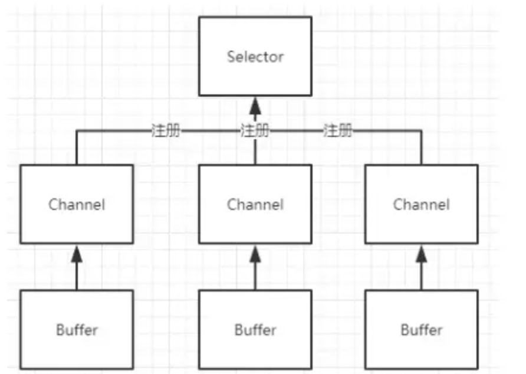

### Java IO 流

#### 一、BIO

BIO :block IO 即阻塞式 IO 流

- 按照流的流向分，可以分为输入流和输出流；

- 按照操作单元划分，可以划分为字节流和字符流；

  字节流主要用来处理字节或二进制对象，字符流用来处理字符文本或字符串

  使用InputStreamReader可以将输入字节流转化为输入字符流:

  ```
  Reader reader  =  new InputStreamReader(inputStream);
  ```

  使用OutputStreamWriter可以将输出字节流转化为输出字符流

  ```
  Writer writer = new OutputStreamWriter(outputStream)
  ```

- 按照流的角色划分为节点流和处理流。


**1） 输入字节流InputStream**：

- **ByteArrayInputStream、StringBufferInputStream、FileInputStream** 是三种基本的介质流，它们分别从Byte 数组、StringBuffer、和本地文件中读取数据。
- **PipedInputStream** 是从与其它线程共用的管道中读取数据。PipedInputStream的一个实例要和PipedOutputStream的一个实例共同使用，共同完成管道的读取写入操作。主要用于线程操作。
- **DataInputStream**： 将基础数据类型读取出来
- **ObjectInputStream** 和所有 **FilterInputStream** 的子类都是装饰流（装饰器模式的主角）。

**2）输出字节流OutputStream：**

- **ByteArrayOutputStream**、**FileOutputStream**： 是两种基本的介质流，它们分别向- Byte 数组、和本地文件中写入数据。
- **PipedOutputStream** 是向与其它线程共用的管道中写入数据。
- **DataOutputStream** 将基础数据类型写入到文件中
- **ObjectOutputStream** 和所有 **FilterOutputStream** 的子类都是装饰流。

**3）字符输入流Reader：：**

- **FileReader、CharReader、StringReader** 是三种基本的介质流，它们分在本地文件、Char 数组、String中读取数据。
- **PipedReader**：是从与其它线程共用的管道中读取数据
- **BufferedReader** ：加缓冲功能，避免频繁读写硬盘
- **InputStreamReader**： 是一个连接字节流和字符流的桥梁，它将字节流转变为字符流。

**4）字符输出流Writer：**

- **StringWriter**:向String 中写入数据。
- **CharArrayWriter**：实现一个可用作字符输入流的字符缓冲区
- **PipedWriter**:是向与其它线程共用的管道中写入数据
- **BufferedWriter** ： 增加缓冲功能，避免频繁读写硬盘。
- **PrintWriter** 和**PrintStream** 将对象的格式表示打印到文本输出流。 极其类似，功能和使用也非常相似
- **OutputStreamWriter**： 是OutputStream 到Writer 转换的桥梁，它的子类FileWriter 其实就是一个实现此功能的具体类。功能和使用和OutputStream 极其类似。

**以读写文件为例**

**（1）从数据源中读取数据**

```
输入字节流：InputStream
```

```
public static void main(String[] args) throws Exception{
       File file = new File("D:/a.txt");
       InputStream inputStream = new FileInputStream(file);
       byte[] bytes = new byte[(int) file.length()];
       inputStream.read(bytes);
       System.out.println(new String(bytes));
       inputStream.close();
}

输入字符流：Reader
public static void main(String[] args) throws Exception{
       File file = new File("D:/a.txt");
       Reader reader = new FileReader(file);
       char[] bytes = new char[(int) file.length()];
       reader.read(bytes);
       System.out.println(new String(bytes));
       reader.close();
}
```

**（2）输出到目标媒介**

```
输出字节流：OutputStream
public static void main(String[] args) throws Exception{
       String var = "hai this is a test";
       File file = new File("D:/b.txt");
       OutputStream outputStream = new FileOutputStream(file);
       outputStream.write(var.getBytes());
       outputStream.close();
}
输出字符流：Writer
public static void main(String[] args) throws Exception{
       String var = "hai this is a test";
       File file = new File("D:/b.txt");
       Writer writer = new FileWriter(file);
       writer.write(var);
       writer.close();
}
```

**（3）BufferedInputStream**

在使用InputStream的时候，都是一个字节一个字节的读或写，而BufferedInputStream为输入字节流提供了缓冲区，读数据的时候会一次读取一块数据放到缓冲区里，当缓冲区里的数据被读完之后，输入流会再次填充数据缓冲区，直到输入流被读完，有了缓冲区就能够提高很多io速度

使用方式将输入流包装到BufferedInputStream中

```
/**  
* inputStream 输入流  
* 1024 内部缓冲区大小为1024byte  
*/ 
BufferedInputStream bufferedInputStream = new BufferedInputStream(inputStream,1024);
```

**（4）BufferedOutputStream**

BufferedOutputStream可以为输出字节流提供缓冲区，作用与BufferedInputStream类似

使用方式将输出流包装到BufferedOutputStream中

```
/**  
* outputStream 输出流  
* 1024 内部缓冲区大小为1024byte  
*/ 
BufferedOutputStream bufferedOutputStream = new BufferedOutputStream(outputStream,1024);
```

字节流提供了带缓冲区的，那字符流肯定也提供了BufferedReader和BufferedWriter

**（5）BufferedReader**

为输入字符流提供缓冲区，使用方式如下

BufferedReader bufferedReader = new BufferedReader(reader,1024);

**（6）BufferedWriter**

为输出字符流提供缓冲区，使用方式如下

```
BufferedWriter bufferedWriter = new BufferedWriter(writer,1024);
```

#### 二、NIO

##### 1. 定义

NIO:非阻塞 IO 模型

##### 2. 核心概念

- Buffer

Buffer是一个对象，它包含一些要写入或者读出的数据，在NIO中所有数据都是用缓存区处理的，在读数据的时候要从缓冲区中读，写数据的时候会先写到缓冲区中，缓冲区本质上是一块可以写入数据，然后可以从中读取数据的一个数组，提供了对数据的结构化访问以及在内部维护了读写位置等信息

```
// 实例化一个 ByteBuffer
// 创建一个容量为 1024 个 byte 的缓冲区
ByteBuffer buffer = ByteBuffer.allocate(1024)
```

如何使用 Buffer:

1. 写入数据到 Buffer
2. 调用 flip()方法将 Buffer 从写模式切换到读模式
3. 从 Buffer 中读取数据
4. 调用 clear()方法或者 compact()方法清空缓冲区，让其可以再次写入

- Channel

  Channel（通道）数据总是从通道读取到缓冲区，或者从缓冲区写入到通道中，Channel只负责运输数据，而操作数据是Buffer

  **通道与流类似，不同地方:**

  （1）在于条通道是双向的，可以同时进行读，写操作，而流是单向流动的，只能写入或者读取

  （2）流的读写是阻塞的，通道可以异步读写

  数据从Channel读到Buffer

  ```
  inChannel.read(buffer);
  ```

  数据从Buffer写到Channel

  ```
  outChannel.write(buffer);
  ```

  **以复制文件为例**

  ```java
  FileInputStream fileInputStream=new FileInputStream(new File(src));
  FileOutputStream fileOutputStream=new FileOutputStream(new File(dst));
  //获取输入输出channel通道
  FileChannel inChannel=fileInputStream.getChannel();
  FileChannel outChannel=fileOutputStream.getChannel();
  //创建容量为1024个byte的buffer
  ByteBuffer buffer=ByteBuffer.allocate(1024);
  while(true){
             //从inChannel里读数据，如果读不到字节了就返回-1，文件就读完了
             int eof =inChannel.read(buffer);
             if(eof==-1){break;}
            //将Buffer从写模式切换到读模式
            buffer.flip();
           //开始往outChannel写数据
            outChannel.write(buffer);
          //清空buffer
           buffer.clear();
  }
  inChannel.close();
  outChannel.close();
  fileInputStream.close();
  fileOutputStream.close();
  ```

  - **Selector**（多路复用选择器）

  Selector是NIO编程的基础，主要作用就是将多个Channel注册到Selector上，如果Channel上发生读或写事件，Channel就处于就绪状态，就会被Selector轮询出来，然后通过SelectionKey就可以获取到已经就绪的Channel集合，进行IO操作了

  Selector与Channel，Buffer之间的关系

 
  
  ##### 3 .NIO 模型

  

  JDK中NIO使用多路复用的IO模型，通过把多个IO阻塞复用到一个select的阻塞上，实现系统在单线程中可以同时处理多个客户端请求，节省系统开销，在JDK1.4和1.5 update10版本之前，JDK的Selector基于select/poll模型实现，在JDK 1.5 update10以上的版本，底层使用epoll代替了select/poll

  epoll较select/poll的优点在于：

  （1）epoll支持打开的文件描述符数量不在受限制，select/poll可以打开的文件描述符数量有限

  （2）select/poll使用轮询方式遍历整个文件描述符的集合，epoll基于每个文件描述符的callback函数回调

  **select，poll，epoll**都是IO多路复用的机制。I/O多路复用就是通过一种机制，一个进程可以监视多个描述符，一旦某个描述符就绪（一般是读就绪或者写就绪），能够通知程序进行相应的读写操作。但select，poll，epoll本质上都是同步I/O，因为他们都需要在读写事件就绪后自己负责进行读写，也就是说这个读写过程是阻塞的，而异步I/O则无需自己负责进行读写

  NIO提供了两套不同的套接字通道实现网络编程，服务端：ServerSocketChannel和客户端SocketChannel，两种通道都支持阻塞和非阻塞模式

使用原生NIO类库十分复杂，NIO的类库和Api繁杂，使用麻烦，需要对网络编程十分熟悉，才能编写出高质量的NIO程序，所以并不建议直接使用原生NIO进行网络编程，而是使用一些成熟的框架，比如Netty