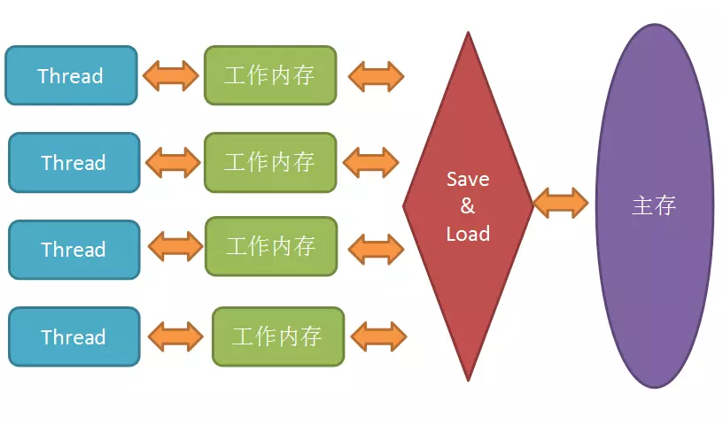

###Java内存模型-JMM

Java虚拟机规范试图定义一种Java内存模型（JMM）,来屏蔽掉各种硬件和操作系统的内存访问差异，让Java程序在各种平台上都能达到一致的内存访问效果。

在Java内存模型里，对上述的优化又进行了一波抽象。JMM规定所有变量都是存在主存中的，类似于上面提到的普通内存，
每个线程又包含自己的工作内存，方便理解就可以看成CPU上的寄存器或者高速缓存。
所以线程的操作都是以工作内存为主，它们只能访问自己的工作内存，且工作前后都要把值在同步回主内存。

在线程执行时，首先会从主存中read变量值，再load到工作内存中的副本中，
然后再传给处理器执行，执行完毕后再给工作内存中的副本赋值，随后工作内存再把值传回给主存，主存中的值才更新。

JMM主要就是围绕着如何在并发过程中如何处理原子性、可见性和有序性这3个特征来建立的，通过解决这三个问题，可以解除缓存不一致的问题。而volatile跟可见性和有序性都有关。