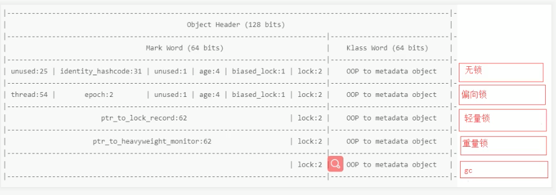

一,什么是对象头

根据openjdk的官方文档:

**object header**
Common structure at the beginning of every GC-managed heap object. (Every oop points to an object header.) Includes fundamental information about the heap object's layout, type, GC state, synchronization state, and identity hash code. Consists of two words. In arrays it is immediately followed by a length field. Note that both Java objects and VM-internal objects have a common object header format.

即:

**对象头**
每个gc管理的堆对象开头的公共结构。(每个oop都指向一个对象标头。)包括
堆对象的布局、类型、GC状态、同步状态和标识哈希码的基本信息。由两个词组成。在数组中，它后面紧跟着一个长度字段。注意，Java对象和vm内部对象都有一个通用的对象头格式。

其中,文档中所说的两个词就是markWord和klass pointer

mark word
The first word of every object header. Usually a set of bitfields including synchronization state and identity hash code. May also be a pointer (with characteristic low bit encoding) to synchronization related information. During GC, may contain GC state bits.

每个对象标头的第一个单词。通常是一组位域，包括同步状态和标识哈希码。也可以是同步相关信息的指针(具有特征的低比特编码)。在GC期间，可能包含GC状态位。

klass pointer
The second word of every object header. Points to another object (a metaobject) which describes the layout and behavior of the original object. For Java objects, the "klass" contains a C++ style "vtable".

每个对象标头的第二个单词。指向描述原始对象的布局和行为的另一个对象(元对象)。对于Java对象，“klass”包含一个c++风格的“vtable”。

当然不同的对象markword中存储的信息会有略微不同,主要和对象的状态有关

关于对象状态:一共五种状态

1. 无状态 (new出来的时候)
2. 偏向锁
3. 轻量锁
4. 重量锁
5. gc标记

在64位的虚拟机中对象头一共占12个byte,也就是96个bit(mark word 64bit,klass pointer 32bit)
注:也有说是128bit,原因是Hotspot虚拟机默认开启指针压缩,所以klass pointer只占32bit

由此可以得知markword主要包含对象的以下信息:
- unused 25bit
- identity hash code(标志hashcode)
- unused 1bit
- age 4bit(对象在from和to区进行复制操作(默认)15次仍然存活会放逐到老年代,为什么是15次,原因是4bit的二进制最大为1111,即15)
- biased_lock 1bit (偏向信息)
- lock 2bit (锁信息)

其中:后3个bit(biased_lock+lock)用来区分对象的不同状态

