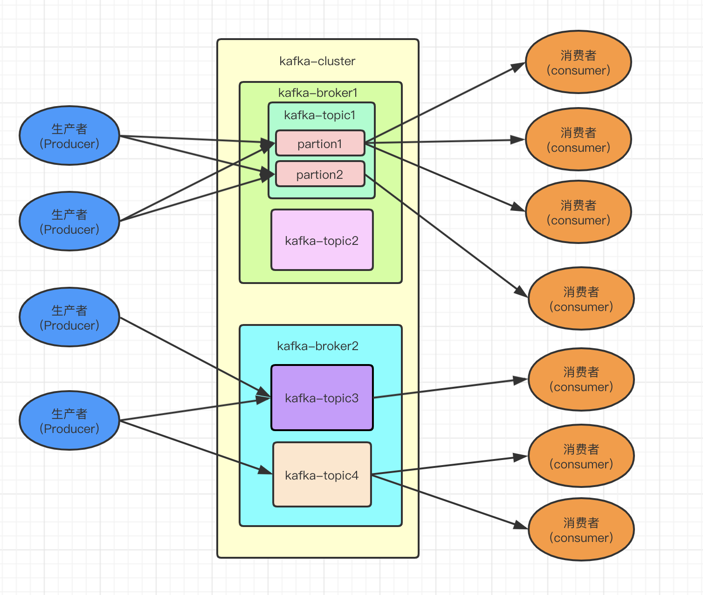

### Kafka学习记录

#### 一、两大应用场景:

1. 消息队列：建立实时流数据管道，从而可靠地在系统或应用程序中获取数据。
2. 数据处理：构建实时的刘淑娟处理程序来转换或处理数据流。

注：

1. Kafka将流数据存储在**topic**中
2. 每个记录有  **一个键、一个值、一个时间戳组成**

#### 二、消息模型

发布订阅模型（Pub-Sub） 使用**主题（Topic）** 作为消息通信载体，类似于**广播模式**；发布者发布一条消息，该消息通过主题传递给所有的订阅者，**在一条消息广播之后才订阅的用户则是收不到该条消息的**。

**在发布 - 订阅模型中，如果只有一个订阅者，那它和队列模型就基本是一样的了。所以说，发布 - 订阅模型在功能层面上是可以兼容队列模型的。**

上面这张图也为我们引出了，Kafka 比较重要的几个概念：

1. **Producer（生产者）** : 产生消息的一方。
2. **Consumer（消费者）** : 消费消息的一方。
3. **Broker（代理）** : 可以看作是一个独立的 Kafka 实例。多个 Kafka Broker 组成一个 Kafka Cluster。

同时，你一定也注意到每个 Broker 中又包含了 Topic 以及 Partion 这两个重要的概念：

- **Topic（主题）** : Producer 将消息发送到特定的主题，Consumer 通过订阅特定的 Topic(主题) 来消费消息。
- **Partion（分区）** : Partion 属于 Topic 的一部分。一个 Topic 可以有多个 Partion ，并且同一 Topic 下的 Partion 可以分布在不同的 Broker 上，这也就表明一个 Topic 可以横跨多个 Broker 。分区引入了多副本机制。多个副本之间存在一个leader,其他的称之为follower。发送的消息从leader副本中拉取消息进行同步。
- **另外**：消息的生产者和消费者只与leader进行消息的传递和消费，其他的follower分区只会在leader节点失效后重新进行选举成为新的leader

**Kafka 的多分区（Partition）以及多副本（Replica）机制有什么好处呢？**

1. Kafka 通过给特定 Topic 指定多个 Partition, 而各个 Partition 可以分布在不同的 Broker 上, 这样便能提供比较好的并发能力（负载均衡）。
2. Partition 可以指定对应的 Replica 数, 这也极大地提高了消息存储的安全性, 提高了容灾能力，不过也相应的增加了所需要的存储空间。

## **Kafka 如何保证消息的消费顺序？**

我们在使用消息队列的过程中经常有业务场景需要严格保证消息的消费顺序，比如我们同时发了 2 个消息，这 2 个消息对应的操作分别对应的数据库操作是：更改用户会员等级、根据会员等级计算订单价格。假如这两条消息的消费顺序不一样造成的最终结果就会截然不同。

我们知道 Kafka 中 Partition(分区)是真正保存消息的地方，我们发送的消息都被放在了这里。而我们的 Partition(分区) 又存在于 Topic(主题) 这个概念中，并且我们可以给特定 Topic 指定多个 Partition。

  

每次添加消息到 Partition(分区) 的时候都会采用尾加法，如上图所示。Kafka 只能为我们保证 Partition(分区) 中的消息有序，而不能保证 Topic(主题) 中的 Partition(分区) 的有序。也就是说消息有序的概念只存在Partition级别。

**消息在被追加到 Partition(分区)的时候都会分配一个特定的偏移量（offset）。Kafka 通过偏移量（offset）来保证消息在分区内的顺序性。**

因此，保证消息消费顺序的方法有：

- 1个Topic只对应一个partition
- 指定 topic, partition, key,data（数据） 4 个参数。如果你发送消息的时候指定了 partition 的话，所有消息都会被发送到指定的 partition。并且，同一个 key 的消息可以保证只发送到同一个 partition，这个我们可以采用表/对象的 id 来作为 key 。