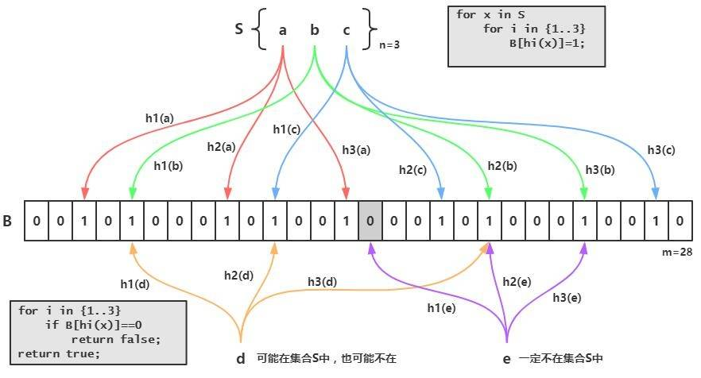

###布隆过滤器-Bloom Filter

一,原理
布隆过滤器的原理是，当一个元素被加入集合时，通过K个Hash函数将这个元素映射成一个位数组中的K个点，
把它们置为1。当检查一个元素是否存在时，我们只要将元素通过K个Hash函数进行计算,
看看这些点是不是都是1就（大约）知道集合中有没有它了：
如果这些点有任何一个0，则被检元素一定不在；如果都是1，则被检元素**很可能在**。这就是布隆过滤器的基本思想

Bloom Filter跟单哈希函数Bit-Map不同之处在于：Bloom Filter使用了k个哈希函数，
每个字符串跟k个bit对应。从而降低了冲突的概率。



由于Hash函数存在Hash碰撞的情况,布隆过滤器无法100%保证检索的数据存在,但是能100%判断出数据不存在,这样就可以用于解决缓存穿透
的情况了

缺陷:
根据上面我们可以知道,布隆过滤器有存在误判的情况,而且由于进行了k次Hash计算,删除就变得十分复杂;即:

- 存在误判，可能要查到的元素并没有在容器中，但是hash之后得到的k个位置上值都是1。
如果bloom filter中存储的是黑名单，那么可以通过建立一个白名单来存储可能会误判的元素。

- 删除困难。一个放入容器的元素映射到bit数组的k个位置上是1，删除的时候不能简单的直接置为0，
可能会影响其他元素的判断。可以采用Counting Bloom Filter


Bloom Filter 实现

布隆过滤器有许多实现与优化，Guava中就提供了一种Bloom Filter的实现。在实现布隆过滤器的时候需要注意两点:即数据量n和误判率fpp
同时需要计算bit数组的大小和Hash函数的个数K;

对于一个确定的场景，我们预估要存的数据量为n，期望的误判率为fpp，然后需要计算我们需要的Bit数组的大小m，以及hash函数的个数k，并选择hash函数

Java实现:

第一步:依赖
```
    <dependency>
        <groupId>com.google.guava</groupId>
        <artifactId>guava</artifactId>
        <version>23.0</version>
    </dependency>  
```
第二部:
```java
public class TestBloomFilter {
    //100w个数据
    private static int total = 1000000;
    private static BloomFilter bloomFilter = BloomFilter.create(Funnels.integerFunnel(), total);

    public static void main(String[] args) {
        // 初始化100w条数据到过滤器中
        for (int i = 0; i < total; i++) {
            bloomFilter.put(i);
        }

        // 匹配已在过滤器中的值，是否有匹配不上的
        for (int i = 0; i < total; i++) {
            if (!bloomFilter.mightContain(i)) {
                System.out.println("元素检查未命中");
            }
        }

        // 匹配不在过滤器中的50000个值，有多少匹配出来
        int count = 0;
        for (int i = total; i < total + 50000; i++) {
            if (bloomFilter.mightContain(i)) {
                count++;
            }
        }
        System.out.println("误判的数量：" + count);
    }
}

```

打印结果:
```
误判的数量：1566

Process finished with exit code 0
```

运行结果表示，遍历这一百w个在过滤器中的数时，都被识别出来了。5w个不在过滤器中的数，误判了1566个，错误率是0.03左右。

打开BloomFilter 源码:
```
    public static <T> BloomFilter<T> create(Funnel<? super T> funnel, int expectedInsertions) {
            return create(funnel, (long)expectedInsertions);
    }   
    public static <T> BloomFilter<T> create(Funnel<? super T> funnel, long expectedInsertions) {
        return create(funnel, expectedInsertions, 0.03D);
    }
    public static <T> BloomFilter<T> create(Funnel<? super T> funnel, long expectedInsertions, double fpp) {
        return create(funnel, expectedInsertions, fpp, BloomFilterStrategies.MURMUR128_MITZ_64);
    }
    public static <T> BloomFilter<T> create(Funnel<? super T> funnel, int expectedInsertions, double fpp) {
        return create(funnel, (long)expectedInsertions, fpp);
    }
```
BloomFilter 一共四个create方法，不过最终都是走向第四个。看一下每个参数的含义：

funnel：数据类型(一般是调用Funnels工具类中的)
expectedInsertions：期望插入的值的个数
fpp 错误率(默认值为0.03)
strategy 哈希算法Bloom Filter的应用
