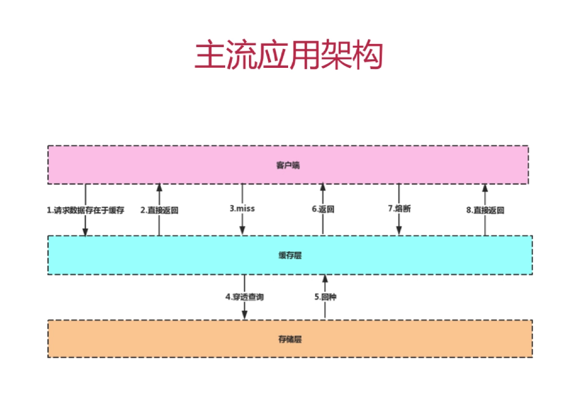
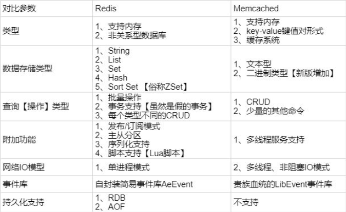

###Redis基础

####使用缓存的原因

从上图中我们可以得知客户端请求服务端的流程大概如下:
 客户端发出请求,到缓存层进行查询,如果数据满足请求则直接返回,如果在缓存层没有,则继续向下到存储层(DB)进行查询
 即穿透缓存查询,并对查询到的数据写入缓存层中,即为回种并返回到客户端
 
 同时,当存储层意外挂掉,可以让请求直接打到缓存层直接返回客户端以此实现熔断,
 在有损的情况下保持对外提供服务 

 ####缓存中间件
 1.常用的缓存中间件有:
 - Memcache
 - Redis
 
 2.Memcache与Redis的区别
 - **redis支持更丰富的数据类型（支持更复杂的应用场景）**：Redis不仅仅支持简单的k/v类型的数据，同时还提供list，set，zset，hash等数据结构的存储。memcache支持简单的数据类型，String。
 - **Redis支持数据的持久化**，可以将内存中的数据保持在磁盘中，重启的时候可以再次加载进行使用,而Memecache把数据全部存在内存之中。
 - **集群模式**：memcached没有原生的集群模式，需要依靠客户端来实现往集群中分片写入数据；但是 redis 目前是原生支持 cluster 模式的.
 - Memcached是多线程，非阻塞IO复用的网络模型；Redis使用单线程的多路 IO 复用模型。
 
 
 ####Redis简介
  简单来说 redis 就是一个数据库，不过与传统数据库不同的是 redis 的数据是存在内存中的，所以读写速度非常快，因此 redis 被广泛应用于缓存方向。另外，redis 也经常用来做分布式锁。redis 提供了多种数据类型来支持不同的业务场景。除此之外，redis 支持事务 、持久化、LUA脚本、LRU驱动事件、多种集群方案。
  
 ####Redis为什么查询效率高
 1.完全基于内存,绝大部分请求是纯粹的内存操作,执行效率高
 2.数据结构简单,对数据操作也简单,存储结构为K-V,查询时间复杂度为O(1)
 3.采用单线程,单线程能处理高并发请求,想多核也可启动多实例;这里的单线程是指,Redis的主线程(IO及相关请求的处理,过期键的处理,复制协调和集群协调 )是单线程的,其他的请求会被主线程封装成周期性的任务被主线程周期性的处理
  由于采用单线程,避免了频繁的上下文切换和锁竞争
 4.采用多路IO复用模型,非阻塞IO,解决Redis主线程串行执行任务过程中可能出现的读写阻塞;
 
 