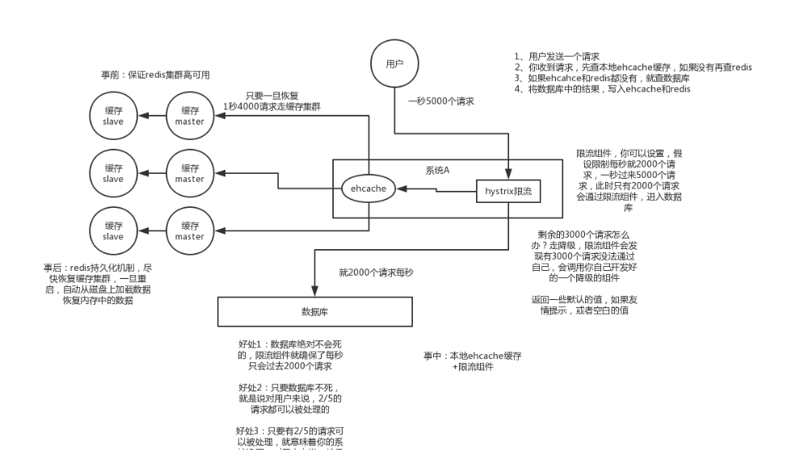

###缓存雪崩和缓存穿透

一,缓存雪崩
缓存数据在某一时间大面积失效/过期,后面的客户端数据请求直接打到数据库,导致数据库在短时间内承受大量的请求而崩掉

解决方案:
- 事前：尽量保证整个 redis 集群的高可用性，发现机器宕机尽快补上。选择合适的内存淘汰策略。
- 事中：本地ehcache缓存 + hystrix限流&降级，避免MySQL崩掉
- 事后：利用 redis 持久化机制保存的数据尽快恢复缓存

