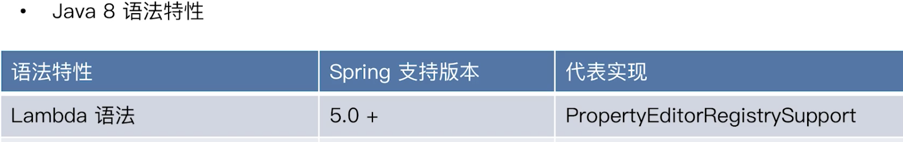

## Spring 模块化设计与 JDK 的运用

### 一、模块化设计

- spring-aop

- spring-aspects

- spring-context-indexer

- spring-context-support

- spring-context

- spring-core

- spring-expression：类似 jsp 的 EL

- spring-instrument：对 Java 装配的支持

- spring-jcl：日志框架，统一日志管理

- spring-jdbc

- spring-jms

- spring-messaging：Java 消息服务的统一支持

- spring-orm：持久化框架

- spring-oxm：XML 的编列与反编列

- spring-test

- spring-tx：Spring事务抽象,借鉴了 JDBC /JavaEE的事务

- spring-web

- spring-webflux

- spring-webmvc

- spring-websocket

  

### 二、Spring 对 Java 语言特性的运用

- Java5 语法特性

### 三、Spring 对 JavaAPI 的运用

#### JDK 核心 API

1.  <Java5

- 反射
- Java Beans
- 动态代理

2. Java5

- 并发框架(J.U.C)
- 格式化（Formatter）
- Java管理扩展（JMX）
- Instrumentation
- XML 处理（DOM、SAX、XPath、XSTL）

3. Java6

- JDBC4.0
- JAXB
- 可插拔注解处理 API
- Common Annotations
- Java Compiler API
- Scripting in JVM

4. Java 7

- NIO
- Fork/Join 框架
- invokedynamic

5. Java8

- Stream API

- CompletableFuture(J.U.C)
- Annotation on Java Types
- Date and Time API
- 可重复 Annotations
- JavaScript 运行时

### 四、Spring 对 JDK API 的实践

