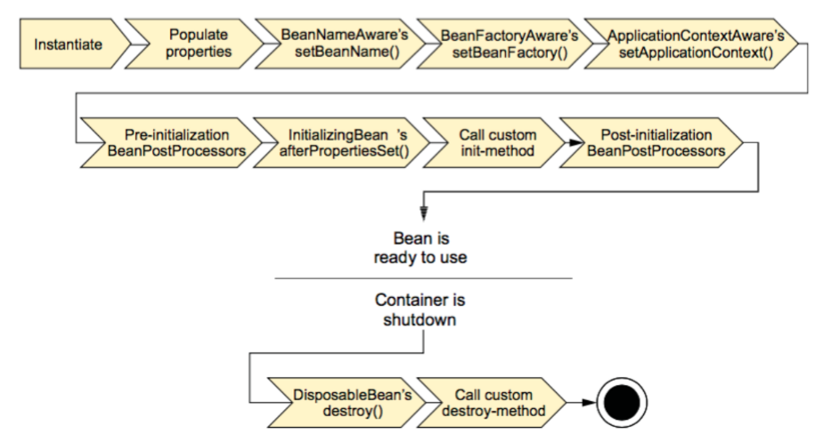
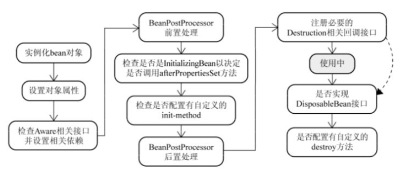

关于Spring的bean

Spring中的bean默认都是单例的,Spring的单例是基于BeanFactory也就是Spring容器的，单例Bean在此容器内只有一个，Java的单例是基于 JVM，每个 JVM 内只有一个实例。

一.bean的作用域

创建一个bean定义，其实质是用该bean定义对应的类来创建真正实例的“配方”。
把bean定义看成一个配方很有意义，它与class很类似，只根据一张“处方”就可以创建多个实例。
不仅可以控制注入到对象中的各种依赖和配置值，还可以控制该对象的作用域。
这样可以灵活选择所建对象的作用域，
而不必在Java Class级定义作用域。Spring Framework支持五种作用域，分别阐述如下表。

五种作用域中，request、session 和 global session 三种作用域仅在基于web的应用中使用，只能用在基于 web 的 Spring ApplicationContext 环境。

1 . **singleton——唯一 bean 实例**

当一个 bean 的作用域为 singleton，那么Spring IoC容器中只会存在一个共享的 bean 实例，并且所有对 bean 的请求，只要 id 与该 bean 定义相匹配，则只会返回bean的同一实例。 singleton 是单例类型(对应于单例模式)，就是在创建起容器时就同时自动创建了一个bean的对象，不管你是否使用，但我们可以指定Bean节点的 lazy-init=”true” 来延迟初始化bean，这时候，只有在第一次获取bean时才会初始化bean，即第一次请求该bean时才初始化。 每次获取到的对象都是同一个对象。注意，singleton 作用域是Spring中的缺省作用域。要在XML中将 bean 定义成 singleton ，可以这样配置：
```
<bean id="ServiceImpl" class="cn.csdn.service.ServiceImpl" scope="singleton">
```
也可以通过 @Scope 注解（它可以显示指定bean的作用范围。）的方式
```
@Service
@Scope("singleton")
public class ServiceImpl{

}
```
2 . **prototype——每次请求都会创建一个新的 bean 实例**

当一个bean的作用域为 prototype，表示一个 bean 定义对应多个对象实例。 
prototype 作用域的 bean 会导致在每次对该 bean 请求（将其注入到另一个 bean 中，或者以程序的方式调用容器的 getBean() 方法**）
时都会创建一个新的 bean 实例。prototype 是原型类型，
它在我们创建容器的时候并没有实例化，而是当我们获取bean的时候才会去创建一个对象，而
**且我们每次获取到的对象都不是同一个对象。根据经验，对有状态的 bean 应该使用 prototype 作用域，
而对无状态的 bean 则应该使用 singleton 作用域。** 在 XML 中将 bean 定义成 prototype ，可以这样配置：
```
<bean id="account" class="com.foo.DefaultAccount" scope="prototype"/>  
 或者
<bean id="account" class="com.foo.DefaultAccount" singleton="false"/> 
```
注解方式:
```
@Service
@Scope("prototype")
public class ServiceImpl{

}
```

3. request——每一次HTTP请求都会产生一个新的bean，该bean仅在当前HTTP request内有效
request只适用于Web程序，每一次 HTTP 请求都会产生一个新的bean，同时该bean仅在当前HTTP request内有效，
当请求结束后，该对象的生命周期即告结束。 在 XML 中将 bean 定义成 request ，可以这样配置：
```
<bean id="loginAction" class=cn.csdn.LoginAction" scope="request"/>
```
4. session——每一次HTTP请求都会产生一个新的 bean，该bean仅在当前 HTTP session 内有效
session只适用于Web程序，session 作用域表示该针对每一次 HTTP 请求都会产生一个新的 bean，
同时该 bean 仅在当前 HTTP session 内有效.
与request作用域一样，可以根据需要放心的更改所创建实例的内部状态，
而别的 HTTP session 中根据 userPreferences 创建的实例，
将不会看到这些特定于某个 HTTP session 的状态变化。当HTTP session最终被废弃的时候，
在该HTTP session作用域内的bean也会被废弃掉。
```
<bean id="userPreferences" class="com.foo.UserPreferences" scope="session"/>
```
5. globalSession
global session 作用域类似于标准的 HTTP session 作用域，
不过仅仅在基于 portlet 的 web 应用中才有意义。
Portlet 规范定义了全局 Session 的概念，它被所有构成某个 portlet web 应用的各种不同的 portle t所共享。
在global session 作用域中定义的 bean 被限定于全局portlet Session的生命周期范围内。
```
<bean id="user" class="com.foo.Preferences "scope="globalSession"/>
```

二.bean的生命周期

实现*Aware接口 在Bean中使用Spring框架的一些对象**
有些时候我们需要在 Bean 的初始化中使用 Spring 框架自身的一些对象来执行一些操作，比如获取 ServletContext 的一些参数，获取 ApplicaitionContext 中的 BeanDefinition 的名字，获取 Bean 在容器中的名字等等。为了让 Bean 可以获取到框架自身的一些对象，Spring 提供了一组名为*Aware的接口。

这些接口均继承于org.springframework.beans.factory.Aware标记接口，并提供一个将由 Bean 实现的set*方法,Spring通过基于setter的依赖注入方式使相应的对象可以被Bean使用。 网上说，这些接口是利用观察者模式实现的，类似于servlet listeners，目前还不明白，不过这也不在本文的讨论范围内。 介绍一些重要的Aware接口：

- ApplicationContextAware: 获得ApplicationContext对象,可以用来获取所有Bean definition的名字。
- BeanFactoryAware:获得BeanFactory对象，可以用来检测Bean的作用域。
- BeanNameAware:获得Bean在配置文件中定义的名字。
- ResourceLoaderAware:获得ResourceLoader对象，可以获得classpath中某个文件。
- ServletContextAware:在一个MVC应用中可以获取ServletContext对象，可以读取context中的参数。
- ServletConfigAware： 在一个MVC应用中可以获取ServletConfig对象，可以读取config中的参数。

BeanPostProcessor
上面的*Aware接口是针对某个实现这些接口的Bean定制初始化的过程， Spring同样可以针对容器中的所有Bean，
或者某些Bean定制初始化过程，只需提供一个实现BeanPostProcessor接口的类即可。 
该接口中包含两个方法，postProcessBeforeInitialization和postProcessAfterInitialization。 
postProcessBeforeInitialization方法会在容器中的Bean初始化之前执行，postProcessAfterInitialization方法在容器中的Bean初始化之后执行。

要将BeanPostProcessor的Bean像其他Bean一样定义在配置文件中
```
<bean class="com.giraffe.spring.service.CustomerBeanPostProcessor"/>
```

Spring Bean的生命周期是这样的：

- Bean容器找到配置文件中 Spring Bean 的定义。
- Bean容器利用Java Reflection API创建一个Bean的实例。
- 如果涉及到一些属性值 利用set方法设置一些属性值。
- 如果Bean实现了BeanNameAware接口，调用setBeanName()方法，传入Bean的名字。
- 如果Bean实现了BeanClassLoaderAware接口，调用setBeanClassLoader()方法，传入ClassLoader对象的实例。
- 如果Bean实现了BeanFactoryAware接口，调用setBeanClassLoader()方法，传入ClassLoader对象的实例。
- 与上面的类似，如果实现了其他*Aware接口，就调用相应的方法。
- 如果有和加载这个Bean的Spring容器相关的BeanPostProcessor对象，执行postProcessBeforeInitialization()方法
- 如果Bean实现了InitializingBean接口，执行afterPropertiesSet()方法。
- 如果Bean在配置文件中的定义包含init-method属性，执行指定的方法。
- 如果有和加载这个Bean的Spring容器相关的BeanPostProcessor对象，执行postProcessAfterInitialization()方法
- 当要销毁Bean的时候，如果Bean实现了DisposableBean接口，执行destroy()方法。
- 当要销毁Bean的时候，如果Bean在配置文件中的定义包含destroy-method属性，执行指定的方法。

图:

或:


其实很多时候我们并不会真的去实现上面说描述的那些接口，那么下面我们就除去那些接口，针对bean的单例和非单例来描述下bean的生命周期：

**单例管理的对象**
当scope=”singleton”，即默认情况下，会在启动容器时（即实例化容器时）时实例化。
但我们可以指定Bean节点的lazy-init=”true”来延迟初始化bean，
这时候，只有在第一次获取bean时才会初始化bean，即第一次请求该bean时才初始化。
如下配置：
```
<bean id="ServiceImpl" class="cn.csdn.service.ServiceImpl" lazy-init="true"/>  
```
如果想对所有的默认单例bean都应用延迟初始化，可以在根节点beans设置default-lazy-init属性为true，如下所示：
```
<beans default-lazy-init="true" …>
```
默认情况下，Spring 在读取 xml 文件的时候，就会创建对象。在创建对象的时候先调用构造器，然后调用 init-method 属性值中所指定的方法。对象在被销毁的时候，会调用 destroy-method 属性值中所指定的方法（例如调用Container.destroy()方法的时候）。

**非单例管理的对象**
当scope=”prototype”时，容器也会延迟初始化 bean，Spring 读取xml 文件的时候，
并不会立刻创建对象，而是在第一次请求该 bean 时才初始化（如调用getBean方法时）。
在第一次请求每一个 prototype 的bean 时，Spring容器都会调用其构造器创建这个对象，
然后调用init-method属性值中所指定的方法。
对象销毁的时候，Spring 容器不会帮我们调用任何方法，因为是非单例，
这个类型的对象有很多个，Spring容器一旦把这个对象交给你之后，就不再管理这个对象了。

为了测试prototype bean的生命周期life.xml配置如下：

```
<bean id="life_prototype" class="com.bean.LifeBean" scope="prototype" init-method="init" destroy-method="destory"/>
```
测试程序：
```
public class LifeTest {
    @Test 
    public void test() {
        AbstractApplicationContext container = new ClassPathXmlApplicationContext("life.xml");
        LifeBean life1 = (LifeBean)container.getBean("life_singleton");
        System.out.println(life1);

        LifeBean life3 = (LifeBean)container.getBean("life_prototype");
        System.out.println(life3);
        container.close();
    }
}
```
运行结果：
```
LifeBean()构造函数
this is init of lifeBean
com.bean.LifeBean@573f2bb1
LifeBean()构造函数
this is init of lifeBean
com.bean.LifeBean@5ae9a829
……
this is destory of lifeBean com.bean.LifeBean@573f2bb1
```

可以发现，对于作用域为 prototype 的 bean ，其destroy方法并没有被调用。
如果 bean 的 scope 设为prototype时，当容器关闭时，destroy 方法不会被调用。
对于 prototype 作用域的 bean，有一点非常重要，那就是 Spring不能对一个 prototype bean 的整个生命周期负责：
容器在初始化、配置、装饰或者是装配完一个prototype实例后，将它交给客户端，随后就对该prototype实例不闻不问了。 
不管何种作用域，容器都会调用所有对象的初始化生命周期回调方法。
但对prototype而言，任何配置好的析构生命周期回调方法都将不会被调用。清除prototype作用域的对象并释放任何prototype bean所持有的昂贵资源，
都是客户端代码的职责（让Spring容器释放被prototype作用域bean占用资源的一种可行方式是，通过使用bean的后置处理器，
该处理器持有要被清除的bean的引用）。谈及prototype作用域的bean时，
在某些方面你可以将Spring容器的角色看作是Java new操作的替代者，任何迟于该时间点的生命周期事宜都得交由客户端来处理。

Spring 容器可以管理 singleton 作用域下 bean 的生命周期，在此作用域下，Spring 能够精确地知道bean何时被创建，何时初始化完成，以及何时被销毁。
而对于 prototype 作用域的bean，Spring只负责创建，当容器创建了 bean 的实例后，bean 的实例就交给了客户端的代码管理，
Spring容器将不再跟踪其生命周期，并且不会管理那些被配置成prototype作用域的bean的生命周期。