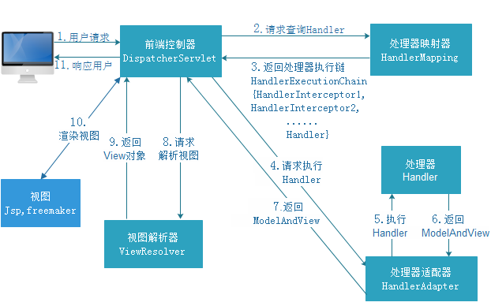

什么是Spring框架

一种轻量级框架,旨在提高开发人员的开发效率以及系统的可维护性;我们一般说 Spring 框架指的都是 Spring Framework，
它是很多模块的集合，使用这些模块可以很方便地协助我们进行开发。
这些模块是：核心容器、数据访问/集成,、Web、AOP（面向切面编程）、工具、消息和测试模块。
比如：Core Container 中的 Core 组件是Spring 所有组件的核心，Beans 组件和 Context 组件是实现IOC和依赖注入的基础，AOP组件用来实现面向切面编程。

Spring 官网列出的 Spring 的 6 个特征:

- 核心技术 ：依赖注入(DI)，AOP，事件(events)，资源，i18n，验证，数据绑定，类型转换，SpEL。
- 测试 ：模拟对象，TestContext框架，Spring MVC 测试，WebTestClient。
- 数据访问 ：事务，DAO支持，JDBC，ORM，编组XML。
- Web支持 : Spring MVC和Spring WebFlux Web框架。
- 集成 ：远程处理，JMS，JCA，JMX，电子邮件，任务，调度，缓存。
- 语言 ：Kotlin，Groovy，动态语言。

Spring模块

下图对应的是 Spring4.x 版本。目前最新的5.x版本中 Web 模块的 Portlet 组件已经被废弃掉，同时增加了用于异步响应式处理的 WebFlux 组件。

- **Spring Core**： 基础,可以说 Spring 其他所有的功能都需要依赖于该类库。主要提供 IoC 依赖注入功能。
- **Spring Aspects** ： 该模块为与AspectJ的集成提供支持。
- **Spring AOP** ：提供了面向方面的编程实现。
- **Spring JDBC** : Java数据库连接。
- **Spring JMS** ：Java消息服务。
- **Spring ORM** : 用于支持Hibernate等ORM工具。
- **Spring Web** : 为创建Web应用程序提供支持。
- **Spring Test** : 提供了对 JUnit 和 TestNG 测试的支持。

关于IoC
IoC（Inverse of Control:控制反转）是一种设计思想，就是 将原本在程序中手动创建对象的控制权，
交由Spring框架来管理。 IoC 在其他语言中也有应用，并非 Spirng 特有。 
IoC 容器是 Spring 用来实现 IoC 的载体， IoC 容器实际上就是个Map（key，value）,Map 中存放的是各种对象。

将对象之间的相互依赖关系交给 IoC 容器来管理，并由 IoC 容器完成对象的注入。
这样可以很大程度上简化应用的开发，把应用从复杂的依赖关系中解放出来。 
IoC 容器就像是一个工厂一样，当我们需要创建一个对象的时候，只需要配置好配置文件/注解即可，
完全不用考虑对象是如何被创建出来的。 在实际项目中一个 Service 类可能有几百甚至上千个类作为它的底层，
假如我们需要实例化这个 Service，你可能要每次都要搞清这个 Service 所有底层类的构造函数，
这可能会把人逼疯。如果利用 IoC 的话，你只需要配置好，然后在需要的地方引用就行了，
这大大增加了项目的可维护性且降低了开发难度。

Spring 时代我们一般通过 XML 文件来配置 Bean，后来开发人员觉得 XML 文件来配置不太好，于是 SpringBoot 注解配置就慢慢开始流行起来。
Spring IoC的初始化过程：

关于AOP
AOP(Aspect-Oriented Programming:面向切面编程)能够将那些与业务无关，却为业务模块所共同调用的逻辑或责任
（例如事务处理、日志管理、权限控制等）封装起来，便于减少系统的重复代码，降低模块间的耦合度，
并有利于未来的可拓展性和可维护性。

Spring AOP就是基于动态代理的，
如果要代理的对象，实现了某个接口，那么Spring AOP会使用JDK Proxy，去创建代理对象，
而对于没有实现接口的对象，就无法使用 JDK Proxy 去进行代理了，这时候Spring AOP会使用Cglib ，
生成一个被代理对象的子类来作为代理

当然你也可以使用 AspectJ ,Spring AOP 已经集成了AspectJ ，AspectJ 应该算的上是 Java 生态系统中最完整的 AOP 框架了。

使用 AOP 之后我们可以把一些通用功能抽象出来，在需要用到的地方直接使用即可，这样大大简化了代码量。
我们需要增加新功能时也方便，这样也提高了系统扩展性。日志功能、事务管理等等场景都用到了 AOP 。

Spring AOP 和 AspectJ AOP 有什么区别？

- Spring AOP 属于运行时增强，而 AspectJ 是编译时增强。
- Spring AOP 基于代理(Proxying)，而 AspectJ 基于字节码操作(Bytecode Manipulation)。

Spring AOP 已经集成了 AspectJ ，AspectJ 应该算的上是 Java 生态系统中最完整的 AOP 框架了。AspectJ 相比于 Spring AOP 功能更加强大，但是 Spring AOP 相对来说更简单，

如果我们的切面比较少，那么两者性能差异不大。但是，当切面太多的话，最好选择 AspectJ ，它比Spring AOP 快很多。

SpringMVC工作原理

- 用户发送请求至前端控制器DispatcherServlet。
- DispatcherServlet收到请求调用HandlerMapping处理器映射器。
- 处理器映射器根据请求url找到具体的处理器，生成处理器对象及处理器拦截器(如果有则生成)一并返回给DispatcherServlet。
- DispatcherServlet通过HandlerAdapter处理器适配器调用处理器。
- 执行处理器(Controller，也叫后端控制器)。
- Controller执行完成返回ModelAndView。
- HandlerAdapter将controller执行结果ModelAndView返回给DispatcherServlet。
- DispatcherServlet将ModelAndView传给ViewReslover视图解析器。
- ViewReslover解析后返回具体View。
- DispatcherServlet对View进行渲染视图（即将模型数据填充至视图中）。
- DispatcherServlet响应用户。 
DispatcherServlet调用HandlerMapping处理器映射器根据url通过处理器适配器调用
controller 并将处理的结果返回到前端控制器，2渲染，最后进行填充和相应。

@Component 和 @Bean 的区别是什么？
- 作用对象不同: @Component 注解作用于类，而@Bean注解作用于方法。
- @Component通常是通过类路径扫描来自动侦测以及自动装配到Spring容器中（我们可以使用 @ComponentScan 注解定义要扫描的路径从中找出标识了需要装配的类自动装配到 Spring 的 bean 容器中）。
@Bean 注解通常是我们在标有该注解的方法中定义产生这个 bean,@Bean告诉了Spring这是某个类的示例，当我需要用它的时候还给我。
- @Bean 注解比 @Component 注解的自定义性更强，而且很多地方我们只能通过 @Bean 注解来注册bean。比如当我们引用第三方库中的类需要装配到 Spring容器时，则只能通过 @Bean来实现。
