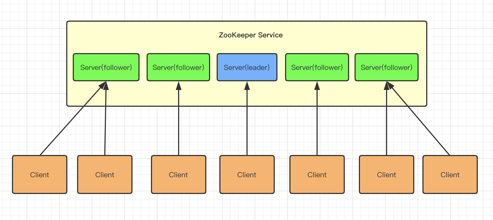
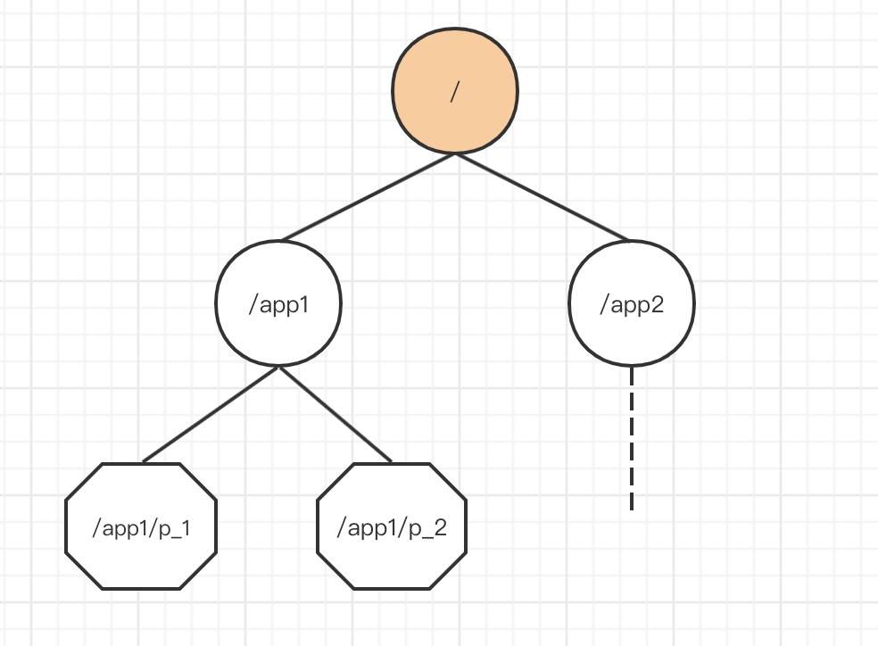

### Zookeeper学习


#### 一、定义

Zookeeper是一个开源的分布式协同系统，可以用来管理不太容易控制的分布式服务，组成一个高级可用的集群服务。
Zookeeper提供了一系列API接口供业务使用。

主要使用场景：配置服务(统一配置管理)，命名服务，集群管理，分布式锁，分布式队列等



#### 二、应用

- 分布式锁，Zookeeper特殊的数据结构和watcher机制，让他也能高效的实现分布式锁的功能，参考Curactor这款框架，分布式锁开箱即用。
- 元数据管理，Kafka就是使用Zookeeper存储核心元数据。
- 分布式协调，Zookeeper的watcher机制可以让分布式系统中的各个节点监听某个数据的变化，并且Zookeeper可以把数据变化反向推送给订阅了的节点，例如kafka里面的各个broker和controller之间的协调。
- Master选举，HDFS就是用了Zookeeper来保证Namenode的 HA高可用，可以保证只有一台成为主。
- Zookeeper提供了全方位的分布式场景下丰富的功能，分布式协调的王者不是虚名。
- 注册中心 Zookeeper可以用作dubbo的注册中心，同时也可以用作springcloud的注册中心
- Zookeeper可以建立长连接
- Zookeeper在分布式服务注册中心当中遵循CP原则（C：一致性；P：分区容错性）
- Zookeeper一般是集群部署，单机不可能满足上面提到的这些功能的实现。我们一般都是用3-5台机器。每台机器都会在内存存储所有的元数据。划重点，Zookeeper是基于内存存储的，这已经决定了他能实现高吞吐高性能


#### 三、Zookeeper文件系统：

zookeeper的内部结构类似于Linux的文件系统，都是树形结构，区别在于Zookeeper中没有目录和文件的区别，统一称为zookeeper、znode，也称为节点。



##### zookeeper树znode的节点类型：

- **持久性(PERSISTENT )**：客户端断开依旧保留
- **临时性(EPHEMERAL )**：客户端断开即删除，而且不可以拥有子节点
- **持久顺序性(PERSISTENT_SEQUENTIAL )**：客户端断开依旧保留，顺序自动编号持久化节点，这种节点会根据当前已存在的节点数自动加 1
- **临时顺序性(EPHEMERAL_SEQUENTIAL)**：客户端断开即删除，临时自动编号节点 顺序型节点由zookeeper维护，单向顺序不断递增

##### 监听器：

​    zookeeper不光有Znode节点，同时还针对zonde做出了监听器，使用这个机制，我们可以实现分布式锁。

##### 监听机制：

​    在ZooKeeper中，所有的读操作（getData，getChildren和exists）都可以设置监听。监听在某些场景下是非常有用的，当你关注某些数据的变化时，如果没有监听，你就只能不断的轮询查看数据是否发生了改变，而监听则可以避免轮询带来的开销。
 **设置监听：**
​    ZooKeeper的监听事件仅触发一次，监听事件异步通知客户端，并支持多种监听方式。

**仅触发一次：**
    当数据改变时，一个监听事件被发送到客户端，并取消监听，除非客户端再次设置监听，否则不再监听。
    如果你调用了getData(“/znode1”, true)方法，第二个参数true表示设置监听，后续如果/znode1发生了改变或删除，客户端将收到监听消息。而如果/znode1再次发生改变，除非客户端执行了另一个设置监听的get操作，否则不会再收到监听消息。 应用使用ZooKeeper的监听功能的通常方式为：

1. 客户端对特定对象设置监听；
2. 特定对象发生变化，服务端发送监听消息到客户端，并取消监听；
3. 客户端收到监听消息，发起查询，并根据需要决定是否再次监听。 ZooKeeper保证查询和监听是一个原子操作，客户端查询数据之后的所有数据变化都能收到监听。

**发送到客户端：**
    要求操作必须成功返回到发起操作的客户端后，才能发送通知消息。监听被异步发送给监听者。ZooKeeper提供了顺序的保证：一个设置了监听的客户端在收到监听事件之前不会看到数据变化。
 **监听方式：**
    这涉及到数据改变的不同方式，ZooKeeper服务端维护了两个监听队列：数据监听队列和孩子监听队列。getData()和exists()设置数据监听，getChildren()设置孩子监听。setData()将触发数据监听，create()将触发一个节点被创建的数据监听和孩子变化的孩子监听，delete()同样将触发一个数据监听和孩子监听。
    监听信息在ZooKeeper的服务端维护，是一个轻量级操作。当一个客户端连接到一个新服务端时，监听将被触发。在客户端与服务端断开连接后，监听将不能发送到客户端，当客户端重连后，任何先前的注册监听将自动重新注册并根据情况触发，整个过程自动完成。
    存在一种情况将出现监听事件丢失：当客户端与服务端断开连接期间，一个被监听的节点创建并且被删除，客户端将收不到任何监听事件。
 ZooKeeper服务端的监听列表仅保存在内存中，不做持久化。当一个客户端与服务端断开连接后，它所有的watch都会从内存中移除，客户端会在重连后自动重新注册它的所有watch。

**监听事件：**
 ZooKeeper提供了以下几种事件类型，下面描述了监听这些事件的方法：

- Created event：调用exists方法设置监听；
- Deleted event：调用exists、getData、getChildren设置监听；
- Changed event：调用getData设置监听；
- Child event：调用getChildren设置监听

**取消监听：**
    客户端能够取消监听，即使连接断开，客户端仍然能够通过设置本地标志来取消监听，取消监听成功后将收到以下事件：

1. Child Remove event：取消getChildren调用注册的监听成功；
2. Data Remove event：取消exists和getData调用注册的监听成功。

**ZooKeeper对监听提供的保障**

1. 监听是有序的，ZooKeeper客户端库确保事件、监听和异步应答的按序分发；
2. 客户端在看到一个节点的新数据之前，将先看到该节点的监听事件；
3. ZooKeeper的监听事件的顺序和ZooKeeper服务查看到的更新的顺序是一致的。

**zookeeper分布式通知与协调。**

1、分布式环境中，一个服务经常需要知道他的子服务状态，

```
	1.1 namenode需知道各个DataNode的状态。

	1.2 resource manager需要知道nodemanager状态
复制代码
```

2、zookeeper实现心跳监测机制，实时信息推送，相当于一个发布/订阅系统。