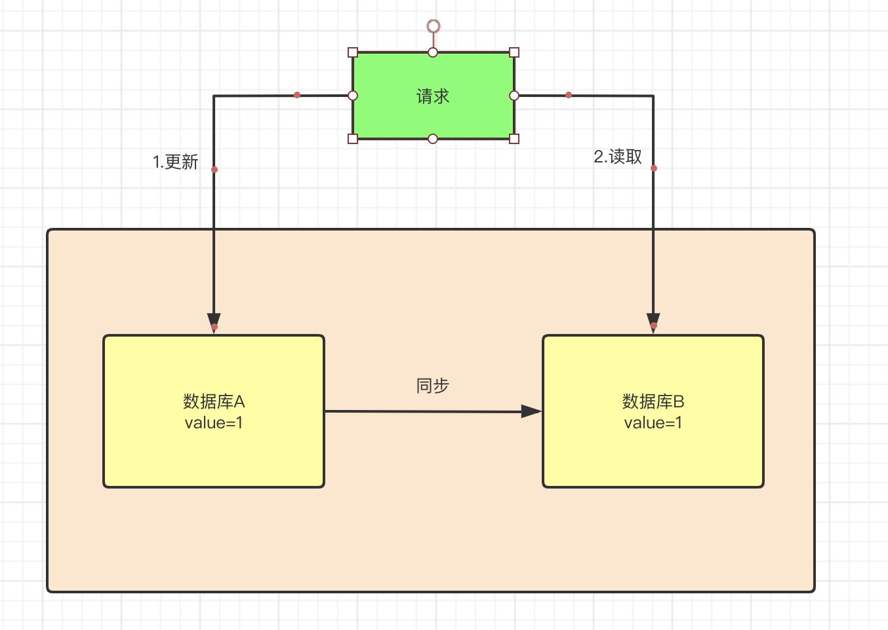

### Zookeeper学习（入门篇）

#### 一、定义

1. ZK是一个数据库

2. ZK是一个具有文件系统特点的数据库
3. ZK是解决数据一致性问题的分布式数据库
4. ZK具有发布订阅功能的分布式数据库（watch）

#### 二、一致性

#### 1.一致性介绍

- 强一致性

  进行步骤2读取操作时，必须等待集群内部数据库数据同步完成以后，这样称之为强一致性

- 弱一致性

  步骤2 读取数据库数据时，允许读出数据库同步之前的数据，这种情况称之为弱一致性

- 最终一致性

  步骤2可以读取到数据同步之前的数据，并且等待一段时间后，数据库AB数据一致，这种情况叫做最终一致性

#### 2.CPA

CAP即：

- Consistency:一致性（强一致性）
- Availability:可用性
- Partition Tolerance:分区容错性

其中：

分区容错性是指在分布式系统中遇到节点或者网络分区故障时，系统仍然可用对外提供满足一致性和可用性的服务

#### 3.如何解决数据一致性问题

##### 3.1 leader-选举机制
- **选举阶段 Leader election**

  最大ZXID也就是节点本地的最新事务编号，包含epoch和计数两部分。epoch是纪元的意思，相当于Raft算法选主时候的term，标识当前leader周期，每次选举一个新的Leader服务器后，会生成一个新的epoch

  - 所有节点处于**Looking状态**，各自依次发起投票，投票包含自己的服务器ID和最新事务ID（ZXID）。
  - 如果发现别人的ZXID比自己大，也就是数据比自己新，那么就重新发起投票，投票给目前已知最大的ZXID所属节点。
  - 每次投票后，服务器都会统计投票数量，判断是否有某个节点得到**半数以上**的投票。如果存在这样的节点，该节点将会成为准Leader，状态变为Leading。其他节点的状态变为Following。

- **发现阶段 Discovery**

  - 为了防止某些意外情况，比如因网络原因在上一阶段产生多个Leader的情况。

  - Leader集思广益，接收所有Follower发来各自的最新epoch值。Leader从中选出最大的epoch，基于此值加1，生成新的epoch分发给各个Follower。

  - 各个Follower收到全新的epoch后，返回ACK给Leader，带上各自最大的ZXID和历史事务日志。Leader选出最大的ZXID，并更新自身历史日志。

- **同步阶段 Synchronization**

  Leader刚才收集得到的最新历史事务日志，同步给集群中所有的Follower。只有当**半数Follower同步成功**，这个准Leader**才能成为正式的Leader**。
##### 3.2 过半机制

##### 3.3 预提交、收到ack、提交（2pc）

